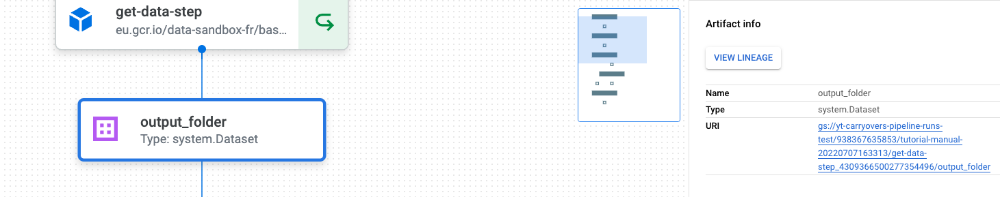

# Vertex Pipeline Starter Kit

This repository aims to help you easily build Machine Learning Pipelines with Vertex AI. 
Whether your goal is to predict sales for a retailer, predict whom among your customers have the higher propensity to buy, you will be guided through the main steps you need to establish a reusable and parametrizable pipeline on the GCP.

The pipelines in this repository are built with Kubeflow v2 and are only composed with functions based components.

This repository contains:

- What you need to get started and set up your environment
- A few examples on pipeline construction with increasing complexity (parallelisation, conditional steps ...)
- And a few words on how you can contribute and/or adapt things


# Table of Contents
- [Dependencies](#dependencies)
- [Repository Structure](#repository-structure)
- [Getting Started](#getting-started)
- [Monitoring pipeline output](#monitoring-pipeline-output)
- [Contribute](#contribute)

# Dependencies

You will need [python3](https://docs.python-guide.org/starting/install3/osx/) and [gcloud cli](https://cloud.google.com/sdk/docs/install-sdk) installed on your local. You can also use VM directly on Vertex AI.
# Repository Structure

```
.
└── ...
├── bin
├── components # represent a step in your ML workflow
    ├── bases_images # A set of containers with helpers functions by theme 
        ├── tutorial # Ex: a forecasting base image for this tutorial
    ├──  explain_predictions
    ├──  preprocesing # a component for data preparation
    ├──  read_data
    ├──  train_model
    ├──  use_deployed_model
    └──  ...
├── config # Configuration files for components and pipelines
    ├── components
        ├── features_engineering 
            ├── config.json # Specify configuration for the feature engineering step
        └── ..
    ├── pipelines
        ├── simple.json # configuration file for a simple training pipeline
        ├── inference.json # a configuration file for running inference
├── docs
├── notebooks
├── pipelines
    ├── src
        ├── tutorial.py # A file that contains many different pipelines run in this tutorial
        ├── run_vertex_pipeline.py # CLI for running and compiling pipelines
        ├── vertex_pipelines.py # Utility function for compiling and running pipelines
├── .env.template # Environment variable to define for experimentation
└──  Makefile # A set of automated workflow 
```

# Getting Started

> ## Set up your environment

To install the required packages, open a terminal and run:

```bash
$ make install
```

This will create a virtual environment named `venv` and install all the required external packages to run the tutorial.

Activate your `virtualenv` with:

````bash
$ source venv/bin/activate
````

> ## Set up your environment variable

This starter kit assumes your project is running on GCP and you would need a service account with the follwing access:

- AI Platform Admin
- Vertex AI user
- Vertex AI administrator
- Monitoring Metric Writer
- Service Account User
- BigQuery Admin
- BigQuery Data Editor
- BigQuery Job User
- Storage Admin

👉 Contact your admin if you cannot [create](https://cloud.google.com/iam/docs/creating-managing-service-account-keys#creating) it yourself. You will also need to generate a secret for your service account. 

Or generate a secret file for the service account named: `yt-vertex-starter-kit` in the project `data-sandbox-fr`.


⛔️ You should never commit that file. Our is saved in a folder named `secrets` which is in our `.gitignore`

Copy the content of the file `.env.template` in a file named `.env` and complete it with information on your project.

- **GOOGLE_APPLICATION_CREDENTIALS**: location of a secret file for your service account
- **GCP_PROJECT_ID**: your GCP Project ID
- **REGION**: GCP Region where you want your pipelines to run
- **IMAGE_NAME**: example of a base image to use to build components
- **IMAGE_TAG**: ⚠️ If you plan to edit the base image, make sure you set the tag to something adapted. If not set, it will default to `latest`
- **MODEL_NAME**: Can be the name of the UC
- **UC_NAME**: A Use Case name (our is named tutorial for ex)
- **EXPERIMENT_NAME**: A experiment name. You can have many in a single UC. It will represent a type of pipeline for example.

After you complete the previous step, export your `env` variables:

````bash
$ export $(grep -v '^#' .env | xargs)
````
---
> 📝 You will need run this command everytime you edit this file or just export the env variable you modify
---


An example of the `.env` file used for the tutorial in this repo 👇

````bash
# Path of your service account key
GOOGLE_APPLICATION_CREDENTIALS=./secrets/data-sandbox-fr-a72002eac794.json
# ID of your GCP Project
GCP_PROJECT_ID=data-sandbox-fr
# region
REGION=europe-west4
# Base Image name
IMAGE_NAME=tutorial
# Image tag if you plan to edit the base image
IMAGE_TAG=latest
# UC name
UC_NAME=tutorial
# Experiment name
EXPERIMENT_NAME=simple # the experiment name should match the pipeline's config file if it exists
````

👉  In addition, and for the examples shown below, we have created 3 buckets on GCS:
- PIPELINE_ROOT : to store all the artifacts of the runs
- BUCKET_PIPELINE_CONFIGS: to store json file that wrap up pipelines' definition
- BUCKET_MODELS: to store a deployed model

You can specify the names in the configuration files: `config/pipelines`. More on that later. 
# Build your first pipelines

`Vertex AI Pipelines` can be seen as managed `Kubeflow Pipelines`. It means that we dont bother with configuring a `kubernetes` cluster to handle compute.

Our pipelines are built with `Kubeflow v2` and are composed of many components, each solving a step in the classical ML workflow. 

We will first show how to build a single component and then demonstrate how to chain many of them into pipeline that serve different purpose.

Finally, we will show you how to compile and run the pipelines.

We will illustrate all the concept named above with the M5 competition. The data can be found [here](https://www.kaggle.com/competitions/forecasting-onboarding)

Before we dive in, a quick introduction about `kubeflow components` and our 2 cents on how we decided to use it in this starter kit.

> ## How do we use Kubeflow Pipelines in this starter kit

There are 2 types of [components](https://www.kubeflow.org/docs/components/pipelines/sdk-v2/component-development/) in Kubeflow: [function based](https://www.kubeflow.org/docs/components/pipelines/sdk-v2/python-function-components/) and [container based](https://www.kubeflow.org/docs/components/pipelines/sdk-v2/component-development/).

You choose between these 2 depending on how complex your component needs to be.
As defined by Kubeflow, a component is a self-contained set of code that performs a step in your ML workflow. Therefore for simple components you will tend to use a function-based that encapsulate all your code within the its body.

If your step is more complex (Ex: needs multiple files) you would instead packaged your code inside a container and use it to perform your ML step.

However it is worth mentionning that function-based components compile and run faster that container based components as you dont need to build the image and push it to a registry. Function-based components run by default on top of a simple python image.

In order to benefit from both worlds, we only use function-based components and instead of running them on top of the default `python image`, we build our own `base image` and copy all our utilities functions inside it. This base image acts as a package and its functions can be imported inside any step of our ML workflow corresponding components.


> ## Building a component

In this section, we will show how to build a single component.

Go to the `components` folder and create a new sub-folder named after your ML step and place a `main.py` inside.

Ex: We will create a component to get the data for the M5 project and make it available for the pipeline

First, you need to decorate your function with `@kfp.v2.dsl.component`. It will allow you to define a few important properites such as the `base image` to use (remember if nothing is set it defaults to `python:3.7`).

---
> 📝 We choose the base image forecasting which we defined in the `.env`
---

````python
import os

from kfp.v2.dsl import Dataset, Output, component


@component(
    base_image=f"eu.gcr.io/{os.getenv('GCP_PROJECT_ID')}/base_image_{os.getenv('IMAGE_NAME')}:{os.getenv('IMAGE_TAG')}"
)
def get_data_step(input_bucket_raw: str, output_folder: Output[Dataset]):
````

Our components takes 1 argument which is the `GCS bucket` where we store all the data downloaded from Kaggle. It is important to specify the types of your arguments.

Learn more about passing arguments in components [here](https://www.kubeflow.org/docs/components/pipelines/sdk/python-function-components/#pass-data)

The body of the function simply contains the content of your step.

Make sure all your **imports are inside the body of the function** for your components to work.

In our example, we import a function to read data from GCS, then we load the data and write it in a folder that will be passed to the next component to use (more on that later).

````python
    from pathlib import Path

    from components.base_images.utils.storage import read_from_gcs

    sales_train = read_from_gcs(input_bucket_raw, "sales_train.csv")
    sales_inference = read_from_gcs(input_bucket_raw, "sales_inference.csv")
    prices = read_from_gcs(input_bucket_raw, "prices.csv")
    calendar = read_from_gcs(input_bucket_raw, "calendar.csv")

    output_folder = Path(output_folder.path)
    output_folder.mkdir(parents=True, exist_ok=True)

    sales_train.to_csv(output_folder / "sales_train.csv")
    sales_inference.to_csv(output_folder / "sales_inference.csv")
    prices.to_csv(output_folder / "prices.csv")
    calendar.to_csv(output_folder / "calendar.csv")
````
> ## Build the pipeline

Now that we know how to create a single component, we can repeat the task for all the steps in our ML workflow.
Once you are satisfied with those components, you can 🔗 them into a reusable and parametrizable pipeline. We will show 3 training pipelines with increasing level of complexity 🧗‍♂️ and 1 inference pipeline to exploit a deployed model.

### A simple pipeline

Let's strat with the simplest one:


Previously, we have seen how to build the `get-data-step`. We have done the same for the other steps of our pipeline: data preparation, feature engineering, model training, model evaluation and model explanation.

The only thing that remains to explain is how do we make sure `Kubeflow` understand how to build a `DAG` out of these individual components.

First let's see how to build the function for the pipeline.
Go to the folder `piplines/src` folder and create a file for your pipeline. For this example we will name it `tutorial.py`.

Inside the file, start by importing all the individual components that you have built in the previous section.

````python
from kfp.v2 import dsl

from components.deploy_model.main import deploying_model_step
from components.evaluate_model.main import evaluate_model_step
from components.explain_predictions.main import explain_predictions_step
from components.features_engineering.main import features_engineering_step
from components.preprocessing.main import prepare_data_step
from components.read_data.main import get_data_step
from components.train_model.main import train_model_step
from components.use_deployed_model.main import using_deployed_model

from pipelines.src.config_loader import load_component_config, load_pipeline_config
````

Create a function that will represent your pipeline and decorate it with `kfp.v2.dsl.pipeline`. This decorator allows you to define some metadata such as a description, a name ...

See the complete pipeline's function below and the comments associated 👇

````python
dsl.pipeline(description="Experiment with a simple training pipeline")
def training_pipeline() -> None:
    """Pipeline for training and conditionnal model deployment.

    This pipeline run a repeatable training and evaluation task.
    It can optionaly deploy a model in a production environment
    if some conditions are met.
    """
    # A. The first step is to load the pipeline config file
    pipeline_config = load_pipeline_config()

    # The next step is to define the pipeline
    #                                                --> model explantion  <--
    #                                               |                         |
    # read_data --> prepare_data --> feature_engineering --> model training --
    #                                               |                         |
    #                                                --> model evaluation  <--

    # 1. Getting the data from BQ
    # Constant inputs can be send in the pipeline's config file
    get_data_task = get_data_step(
        input_bucket_raw=pipeline_config["input_bucket_raw"],
    )

    # 2. Preparing the data
    preprocessing_config = load_component_config(
        "preprocessing", pipeline_config["uc_name"]
    )
    prepare_data_task = prepare_data_step(
        input_folder=get_data_task.outputs["output_folder"], config=preprocessing_config
    )

    # 3. Engineer features
    # One can also decide to load component's config like this:
    features_engineering_config = load_component_config(
        "features_engineering", pipeline_config["uc_name"]
    )
    features_engineering_task = features_engineering_step(
        input_folder=prepare_data_task.outputs["output_folder"],
        config=features_engineering_config,
    ).set_memory_limit("32G")

    # 4. Train a model
    train_model_config = load_component_config(
        "train_model", pipeline_config["uc_name"]
    )
    train_model_task = train_model_step(
        input_folder=features_engineering_task.outputs["output_folder"],
        config=train_model_config,
    ).set_memory_limit("32G")

    # 5. Evaluate a model
    # The previous loaded config can also be used later in the DAG
    evaluate_model_task = evaluate_model_step(
        input_folder=features_engineering_task.outputs["output_folder"],
        model_artifact=train_model_task.outputs["model_artifact"],
        config=train_model_config,
    ).set_memory_limit("32G")

    # 6. Explain predictions
    explain_predictions_task = (
        explain_predictions_step(
            input_folder=features_engineering_task.outputs["output_folder"],
            model_artifact=train_model_task.outputs["model_artifact"],
            config=train_model_config,
        )
        .set_cpu_limit("8")
        .set_memory_limit("32G")
    )

````

Notice how the input of the `prepare_data_step` is taken directly from the output of the `get_data_step`. The same is done for the next steps and that is how `Kubeflow` build the `DAG`. 

---
> 📝 A step can inherit inputs from 2 components at the same time. Ex: the evaluation step takes input from the `features_engineering_step` and the `train_model_step` at the same time.
---
### Configuration files:

We have 2 ways to customize our ML workflow by using config file for the entire pipeline (Ex: `simple.json`) and/ or with component's specific config file (Ex: `features_engineering/tutorial/config.json`)


> Example 1: Specify parameters through pipeline's config

Inside the `config` folder, create a json file that contains your configuration data and named it as your experiment name ( 👉 important for our CLI to work).

````json
{
    "input_bucket_raw":"gs://vertex-pipelines-tutorial-raw",
}
````

> Example 2: Specify parameters through component's config

You can optionnaly use component's specific configuration.

````python
    # 3. Engineer features
    # One can also decide to load component's config like this:
    features_engineering_config = load_component_config(
        "features_engineering", pipeline_config["uc_name"]
    )
    features_engineering_task = features_engineering_step(
        input_folder=prepare_data_task.outputs["output_folder"],
        config=features_engineering_config,
    ).set_memory_limit("32G")
````
### A pipeline with parallelization

Sometimes, we need to experiment with multiple models at the same time.

Let's say we want to perform an `hyperparameter search` on the best `objective` for our model. Ideally you would have the different models running in parralel. That might take you hours to have it up and running.

With Vertex AI pipelines, it can be done with a simple for loop 😅

````python
    # // can simply be done with for loops
    for obj in pipeline_config["objectives"]:
        train_model_config["lgb_params"]["objective"] = obj
        train_model_task = train_model_step(
            input_folder=features_engineering_task.outputs["output_folder"],
            config=train_model_config,
        ).set_memory_limit("32G")

        # 5. Evaluate a model
        # The previous loaded config can also be used later in the DAG
        evaluate_model_task = evaluate_model_step(
            input_folder=features_engineering_task.outputs["output_folder"],
            model_artifact=train_model_task.outputs["model_artifact"],
            config=train_model_config,
        ).set_memory_limit("32G")

        # 6. Explain predictions
        explain_predictions_task = (
            explain_predictions_step(
                input_folder=features_engineering_task.outputs["output_folder"],
                model_artifact=train_model_task.outputs["model_artifact"],
                config=train_model_config,
            )
            .set_cpu_limit("8")
            .set_memory_limit("32G")
        )


````

Plus you get to have a nice visualization of the `DAG`:


### A pipeline with conditional steps

Once you have done your hyperparameter search, the next natural step is to deploy the best model. But on what condition?

A simple rule of thumb would be to based it on a metric reaching a pre-defined threshold (with the business of course).

In this tutorial, we are running a forecasting project, therefore we will check whether the `FA` is above a certain value before we deploy our model inside a bucket our production uses.


> 👉 You can see that no all models have been deployed.

💡 You can customize the runtime environment for a specific components in your ML workflow.

Ex: Our feature engineering step needs more memory, so we adapt things. You can also adapt the number of `vcpu`

```python
    features_engineering_task = features_engineering_step(
        input_folder=prepare_data_task.outputs["output_folder"],
        config=features_engineering_config,
    ).set_memory_limit("32G")
```

### The inference pipeline

Now that we have deployed a chosen model in a bucket on GCS, we can create an inference pipeline which sole purpose will be to create prediciton on unseen data. It will reuse a few steps of the previous training pipeline (components are reusable when well configured).


## Running Pipelines

To run our pipelines, we have made a few helpers functions that compiles, run or do both at the same time. See the file `pipelines.src.vertex_pipelines.py` for more details. Especially, look how the pipeline's function is specified in the inner function `pipeline_func` of the `compile` function. Edit accrodingly if needed.

We have also made a `CLI` to compile & run pipelines easily. Check `run_vertex_pipelines.py` for more details.

As you may have already guessed it, we need to compile a pipeline before we can run it:

````bash
$ make compile
````

This step will actually build a `json`that represents the entire pipeline and save it for later usage (on GCS or in a local folder).

When the pipeline has compiled correctly, you should see a json file in the folder `pipelines/runs` or in the specified folder on GCS.

To run the piplines and start the ML workflow, run the following:

````bash
$ make run_pipeline
````

Follow the link that is printed on your terminal, you should be redirected to your running pipeline 🥳


## Example of completed pipelines 🎉 

- [simple training pipeline](https://console.cloud.google.com/vertex-ai/locations/europe-west4/pipelines/runs/tutorial-simple-20220729162540?project=data-sandbox-fr)
- [training pipeline in parallel](https://console.cloud.google.com/vertex-ai/locations/europe-west4/pipelines/runs/tutorial-parallel-20220729162613?project=data-sandbox-fr)
- [training pipeline in parallel with conditional deployment](https://console.cloud.google.com/vertex-ai/locations/europe-west4/pipelines/runs/tutorial-conditional-20220729162644?project=data-sandbox-fr)
- [Inference pipeline](https://console.cloud.google.com/vertex-ai/locations/europe-west4/pipelines/runs/tutorial-inference-20220729171809?project=data-sandbox-fr)

# Monitoring pipeline output

There are many ways to monitor running pipelines.
## Vertex Interface

Pipelines outputs can be monitored using the Vertex interface.

For example go to [this link](https://console.cloud.google.com/vertex-ai/pipelines) to list all the pipelines in your proejct. Make sure to select the region where your pipelines have been deployed.

Select a pipeline and then view the metrics and data saved at each step of the pipeline. 

Ex: If you hover over a step, you can see which base image is being used:


If you click on the box linking 2 steps in your pipeline, you will get informations about some metadata. Ex: where the outputs are located:



If a step has multiple inputs and outputs, you can verify them easily as well


# Contribute

As you can see, all our pipelines components are based on functions we packaged inside the tutorial base image.

Many functions are available but things can always we improved to best fit your needs. In this repository, there is an example of a simple base image that applies to the M5 competition but feel free to duplicate it and make it your own. 

If you edit functions inside the base image, make sure to build it again and push it to your container registry. Here we are using cloudbuild to do so with the command:

````bash
$ make build_base_image
````

---
> 📝 **Warning:** The base image name you specify inside the .env is important as it is used to know which Dockerfile to build. Check the `bin/build_base_image.sh` for more information.
---

At Artefact, we have a base image store that contains ready to use packages for many ML domains. Here is the link of the [repository](https://github.com/artefactory-fr/vertex-ai-base-images). Just follow the README ✌️

## CICD
To automate building & deployment of our pipeline, we have implemented a CICD with github actions.
For now, the CI only runs the linting and formating of the code.
## Linting  & Formating
We are using black, isort and flake8 for code formatting and linting. To lint all files in the repo, run:

````bash
$ make lint
````

The black, isort and flake8 packages have already been installed in your virtual environment with dependencies if you have followed requirements setup above. Also, a flake8 configuration file (`.flake8`) is available at the root at this repository.

## Pre-commit hooks

We are using pre-commit hooks to point out linting issues in our code before submission to code review.

The pre-commit package has already been installed in your virtual environment with dependencies. Also, a pre-commit configuration file (.pre-commit-config.yaml) is available at the root of this repository.

To finalize the installation and install git hooks scripts, execute: 
````bash
$ pre-commit install
````
For now on, the pre-commit command will run automatically on every git commit.

## Troubleshoot

If you are having problem with compiling your requirements, maybe install another version of pip.

````bash
$ pip install pip==21.0.1
````
